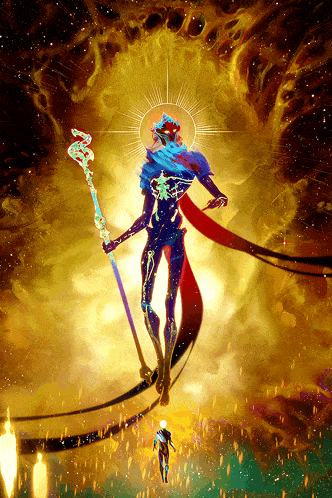

<h1 align="center">Glorious Evolution</h1>

  

###

## Hello, I am João! 👋

- Computer Engineer committed to continuous learning and improvement.
- Proficient in Python | Java | Kotlin | C/C++.
- Currently expanding knowledge in software development and related fields.
- Enthusiastic about technology and problem-solving challenges!

  
  

###

## Technologies

  
  
  
  
  
  
  
  
  
  
  
  
  

###
###

## Statistics

  
  

###
